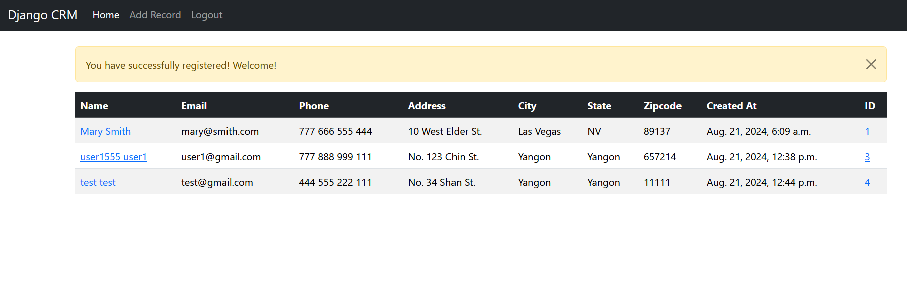

# Tiny Customer Relation Management System
This project is coded using Python, Django, MySQL

## Demo



## Prerequisities
- Python 3.12+
- Django 4.0
- MySQL (For me I used Xampp Server) / Xampp 8.2.12

## Installation
Please follow the steps:

### Step 1
```shell 
    git clone https://github.com/phyodev/CRM.git
```

### Step 2
```shell 
    cd CRM/
```

### Step 3
```shell 
    python -m venv venv
```

### Step 4
```shell 
    source /venv/bin/activate   # activate the virtual environment
```

### Step 5
```shell
    pip install -r requirements.txt
```

### Step 6
- Install [Xampp](https://link-url-here.org)
- Open Xampp on Local Machine
- Run Apache and MySQL on Application
- Create database on MySQL Admin

> **_NOTE:_**   We should set MySQL username and password for database access.

### Step 7
- Change database config in settings.py

**_Example-_**
```
DATABASES = {
    'default': {
        'ENGINE': 'django.db.backends.mysql',
        'NAME': 'crm_db',
        'USER': 'root',
        'PASSWORD': 'Root@example123',
        'HOST': 'localhost',
        'PORT': '3306'
    }
}
```

### Step 8
- `cd /dcrm`
```shell
    python manage.py runserver
```
